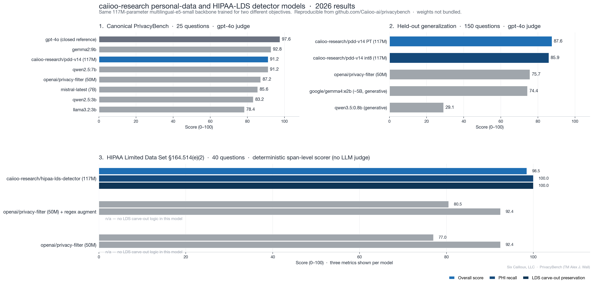

# PrivacyBench

This repository is dedicated to benchmarking legal and privacy-related performance of generative AI models and is used to enable appropriate and effective use of AI to assist with legal and compliance matters.

*Snapshot from the May 2026 evaluation run across the three benchmarks in this repository: the canonical 25-question [PrivacyBench](pii_redaction_task/), the 150-question [held-out generalization suite](pii_redaction_heldout_2026/), and the 40-question [HIPAA Limited Data Set compliance bench](hipaa_lds_task/). All numbers are reproducible from the per-question result JSONs in each task directory. See [`MODELS.md`](MODELS.md) for the ownership and availability status of every model identifier shown.*

**Purpose of PrivacyBench**

- Existing industry benchmarks, such as the , provide strong indications of linguistic understanding but are not specifically tuned to measure legal, privacy, and compliance tasks.
- Existing benchmarks are not adequately specific to legal, privacy and compliance tasks.

**Proposed Solution**

- Develop a testing method for benchmarking performance in personal data redaction.
- Develop and report on LLM performance.
- Identify, in particular, LLM models that can be deployed locally and efficiently for maximum privacy and security and lowest cost.
- Encourage the community development of better tools through benchmarking.

**Call for contributions**

- This repository is open-sourced under MIT license and the code and testing process is free to use with appropriate credit attribution (subject to third-party licenses).

**Specific Tasks**

- The first use case selected to be benchmarked and tested is personal data detection and redaction; please see this task in this repo for additional details.

**Trademark**

- PrivacyBench is a trademark of Alex J. Wall.

**About the models referenced in result tables**

- The benchmark code, questions, methodology, and per-question result rows
  in this repository are MIT-licensed (see `LICENSE`).
- Specific *models* appearing in those result tables are owned by their
  respective publishers and licensed separately. The `caiioo-research/*`
  models published by Six Cailloux, LLC. (the company that maintains this
  benchmark) are **proprietary and not currently available for download** —
  they appear in result tables as reference points, not as openly
  redistributable artifacts.
- See `MODELS.md` for the full list of models referenced, where each can be
  obtained, what license each falls under, and which are proprietary.